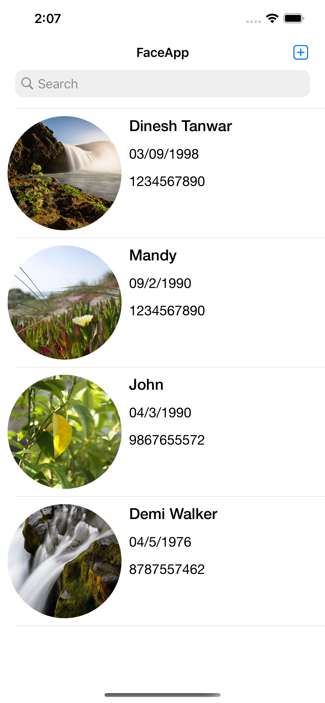
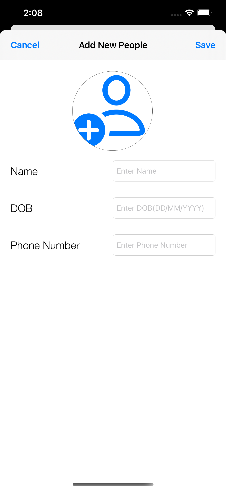

# FaceRecognize
Face App + MMVM + Swift

## Requirements

- Swift 5.0
- Xcode 12 or greater
- iOS 13.0 or greater

## Installation

### CocoaPods
1- IQKeyboardManagerSwift

## Usage

App UI

1- Main Screen

2- Add People Screen

3- Search Screen

4- Detailed Screen

## Author
- LinkedIn:[@Dinesh](https://www.linkedin.com/in/idktanwar/)
- Gtihub [@Dinesh](https://github.com/idktanwar/)

## License
@copyright dk@2021
